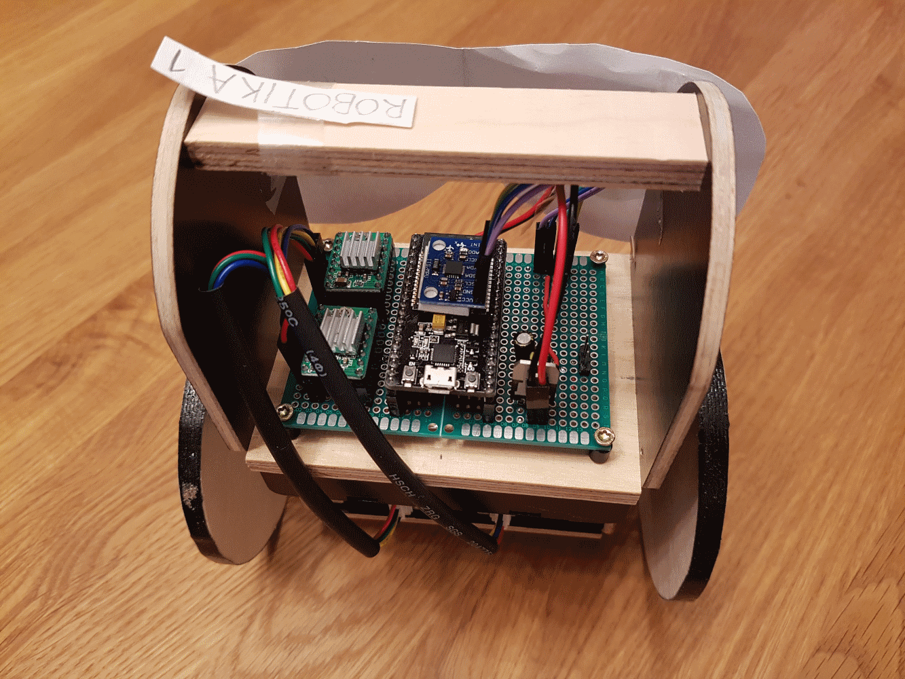
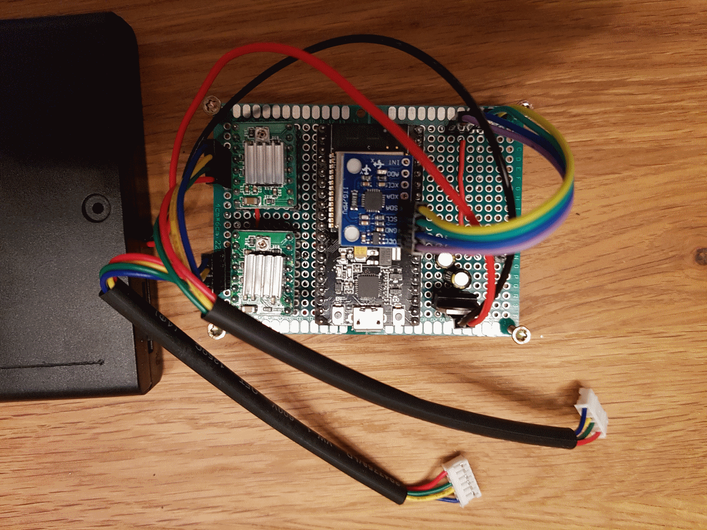
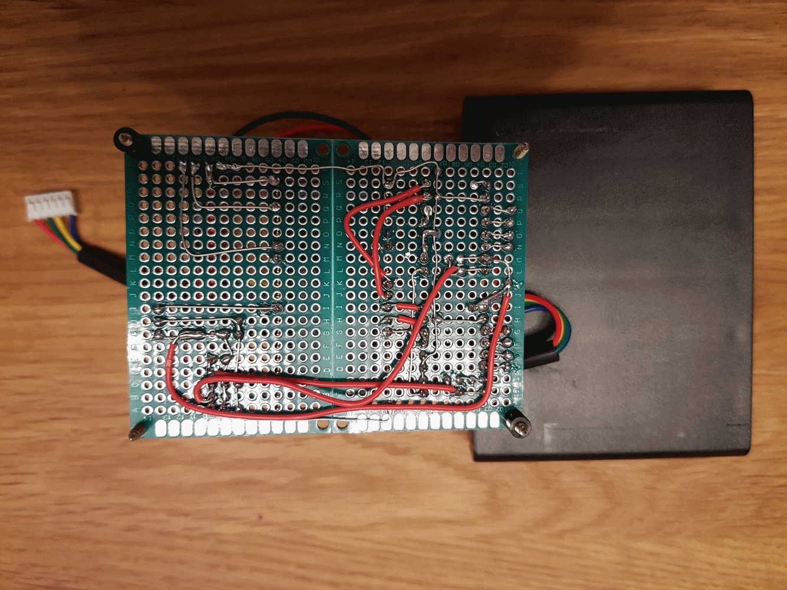

# B-ROBOT_EVO2_ESP32
ESP32 port of JJRobots brilliant B-ROBOT_EVO2

The robot:

Circuit top:

Circuit bottom:

Pin connections (refer to defines.h to change):
* Enable motors: P12
* Servo: P17
* Motor1 Dir: P27
* Motor1 Step: P14
* Motor2 Dir: P25
* Motor2 Step: P26
* I2C pins for gyro: (defaults) SDA=P21, SCL=P22

ESP-32 Board is a NodeMCU ESP32s, see [Pinout](http://esp32.net/images/Ai-Thinker/NodeMCU-32S/Ai-Thinker_NodeMCU-32S_DiagramPinout.png).

**Important note:** At the time of this writing (January 2018) the recent version of arduino-esp32 contains changes that break the I2C communication with the IMU a few seconds after startup.
This version is known to work reliably for the purpose of the robot:
https://github.com/espressif/arduino-esp32/tree/32c028a27e6b3c3c3df769bb42f0d87917e0309c

For more details on the I2C problem mentioned, please refer to these issues (haven't tried the forks mentioned there):
* https://github.com/espressif/arduino-esp32/issues/834
* https://github.com/espressif/arduino-esp32/issues/839
